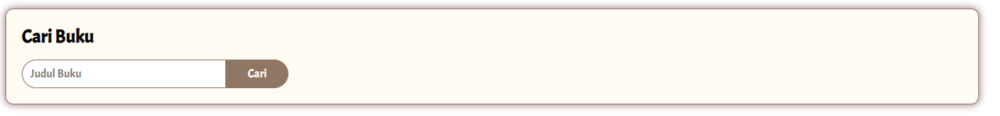

# PROJEK AKHIR DICODING "Belajar Membuat Front-End Web untuk Pemula"

Source Code ini digunakan untuk memenuhi projek akhir Dicoding kelas Belajar Membuat Front-End Web untuk Pemula

## Screenshoot Web

Tampilan Awal

Tampilan saat Memasukkan Buku

Tampilan saat Mencari Buku

Tampilan Daftar Buku

